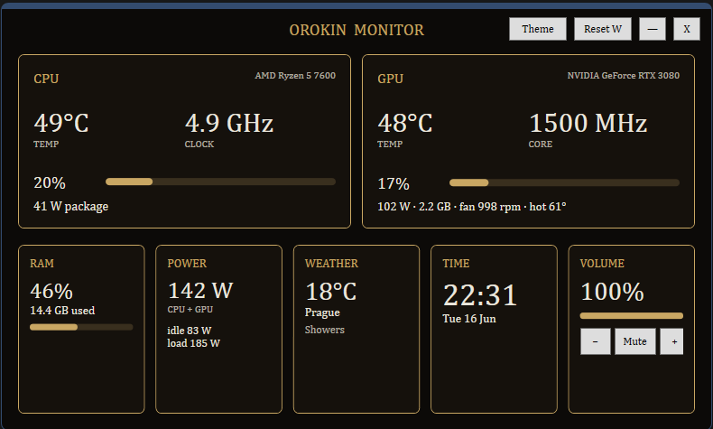
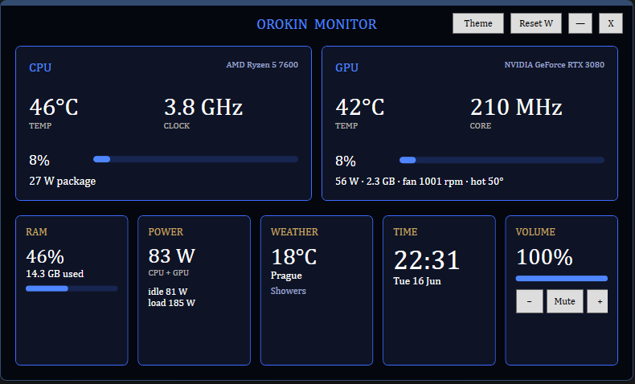
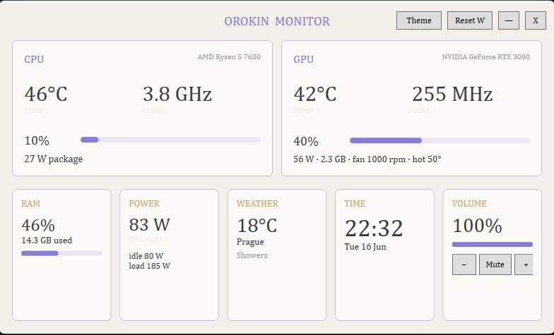

<div align="center">

# Orokin Monitor

**A standalone Windows hardware dashboard for small secondary displays — Warframe / Orokin themed.**

CPU · GPU · RAM · power (idle/load) · weather · clock · volume — in one 800×480 panel.
No HWiNFO, no MSI Afterburner, no Rainmeter required.


[](https://github.com/MrMarkrix/orokin_monitor/releases/latest)

</div>

---

## What it is

Orokin Monitor is a small, always-running hardware readout designed to live on a
secondary screen — a cheap 800×480 USB/HDMI panel, a spare monitor, or a corner
of your desktop. It reads your sensors directly through
[LibreHardwareMonitorLib](https://github.com/LibreHardwareMonitor/LibreHardwareMonitor)
(which ships its own signed kernel driver, the same way HWiNFO does), so it needs
no other monitoring software running in the background.

It is styled after the **Orokin** aesthetic from *Warframe* — gold on dark — and
ships with two extra themes for legibility on different panels.

## Note

Most people just want the app: grab the latest build from the
[**Releases**](https://github.com/MrMarkrix/orokin_monitor/releases) page (see
**Install → Option A** below).

The weather defaults to Prague, but you don't need to edit anything — click the
**WEATHER** panel in the app to search for and set your own city. The sections
below cover that, plus configuration and building from source.

## Features

- **Two large panels** for CPU and GPU, four smaller ones for RAM, power, weather,
  time, and volume — laid out symmetrically for an 800×480 landscape screen.
- **CPU:** temperature, top core clock, load, package power.
- **GPU:** temperature, core clock, load, power draw, VRAM used, fan speed, hotspot temp.
- **RAM:** usage %, GB used, and DIMM temperature if your board exposes it.
- **Total power** (CPU package + GPU) with **idle / load** min–max tracking — useful
  for seeing the gap between desktop-idle and full-load draw.
- **Weather** via [Open-Meteo](https://open-meteo.com/) (free, no API key) —
  click the WEATHER panel to search and change city, no config editing needed.
- **Clock** and **volume control** (real Windows master volume + mute).
- **Three themes**, switchable at runtime and remembered between runs:
  - **Orokin** — gold on near-black
  - **Royal** — high-contrast royal blue on navy (best on dim/washed-out panels)
  - **Pastel** — light background, soft ink (bright rooms, low eye strain)
- **Runs in the system tray.** Minimise or close to hide; it keeps polling in the
  background. Double-click the tray icon to reopen; right-click to exit.
- **Self-elevating** — prompts for admin once (required to read temps/power).

## Screenshot

| Orokin | Royal | Pastel |
|:---:|:---:|:---:|
|  |  |  |

The included tray / app icon (`orokin.ico`) is a golden Orokin motif on dark brown.

---

## Requirements

- **Windows 10 or 11, 64-bit.**
- Administrator rights at runtime (for sensor access — this is a Windows
  limitation; user-space apps can't read hardware temps/power without it).
- **.NET 8 SDK** — only if you build from source (Option B below).

## Install

There are two ways to get it.

### Option A — Download the prebuilt app (easiest, no .NET needed)

1. Go to the [**Releases**](https://github.com/MrMarkrix/orokin_monitor/releases) page.
2. Download the latest `OrokinMonitor-win-x64.zip`.
3. Extract it anywhere.
4. Run `OrokinMonitor.exe` and accept the administrator prompt.

This build is self-contained — it bundles the .NET runtime, so nothing else to install.

### Option B — Build from source

Requires the [**.NET 8 SDK**](https://dotnet.microsoft.com/download/dotnet/8.0)
(pick the **SDK**, not just the runtime).

```powershell
git clone https://github.com/MrMarkrix/orokin_monitor.git
cd orokin_monitor
dotnet publish -c Release -r win-x64 --self-contained false -o publish
```

The app is built to `publish\OrokinMonitor.exe`.

> For a portable build that runs without .NET installed (the same kind shipped in
> Releases), use `--self-contained true` instead. Larger output, no dependency.

## Run

Launch `OrokinMonitor.exe` (double-click, or from a terminal). It will
prompt for administrator rights — accept it, or sensors won't read.

| Action | How |
|---|---|
| Move the window | Drag the top bar (it's borderless) |
| Resize | Drag the edges |
| Switch theme | **Theme** button (cycles Orokin → Royal → Pastel, saved) |
| Reset idle/load power | **Reset W** button, or tray menu |
| Change weather city | Click the **WEATHER** panel, search, pick a city |
| Change volume | − / Mute / + buttons in the Volume panel |
| Hide to tray | Minimise (—) or close (X) — keeps running |
| Reopen | Double-click the tray icon |
| Quit for real | Right-click tray icon → **Exit** |

To use it on an 800×480 secondary monitor: drag it over and resize to fill.

---

## Configuration

A file `orokin-config.json` is created next to the exe on first run:

```json
{
  "Theme": "orokin",
  "Latitude": 50.0755,
  "Longitude": 14.4378,
  "LocationName": "Prague",
  "UseFahrenheit": false,
  "CpuTempWarn": 85,
  "GpuTempWarn": 80,
  "RefreshMs": 1000
}
```

- `Latitude` / `Longitude` / `LocationName` — weather location.
- `UseFahrenheit` — `true` for °F, `false` for °C (applies to hardware and weather temps).
- `CpuTempWarn` / `GpuTempWarn` — temperature (°C) at which the readout turns its
  "hot" colour.
- `RefreshMs` — sensor poll interval in milliseconds.

## Troubleshooting

**"Windows protected your PC" on first launch.** The downloaded `.exe` isn't
code-signed (signing certificates cost money), so Windows SmartScreen flags it.
It's safe to run: click **More info**, then **Run anyway**. If you'd rather not
trust a prebuilt binary, build it yourself from source (Option B) — the result
is identical.

**A value shows "—".** That sensor wasn't found or isn't readable. Dump everything
your hardware exposes:

```powershell
.\publish\OrokinMonitor.exe --dump > sensors.txt
```

Open `sensors.txt` — it lists every hardware node and sensor by its exact name.
If a value you want is present under a name the auto-detect missed, adjust the
keyword lists in [`SensorService.cs`](SensorService.cs) (the `prefer:` arrays).

**Common cases:**

- **GPU shows the wrong card** (e.g. a Ryzen/Intel iGPU instead of your discrete
  GPU). The selector prefers NVIDIA when present; for other combos, edit
  `FirstGpu()` in `SensorService.cs`.
- **GPU voltage is blank.** NVIDIA GeForce cards generally don't expose core
  voltage to software — this isn't a bug. (The GPU panel shows fan + hotspot
  instead of voltage for this reason.)
- **`dotnet run` fails with "requires elevation".** `dotnet run` can't elevate.
  Run the published `.exe` from an **administrator** terminal, or just
  double-click it.
- **Weather shows "unavailable" or city search returns nothing.** The app needs
  outbound access to `api.open-meteo.com` (weather) and
  `geocoding-api.open-meteo.com` (city search). If you're behind a strict
  firewall, allow those two domains.

---

## How it works

- **Sensors:** `LibreHardwareMonitorLib` opens the CPU, GPU, memory, and
  motherboard nodes and is polled on a timer. Values are matched by sensor-type +
  name, with a "highest sensor of this type" fallback so it degrades gracefully on
  unfamiliar hardware.
- **Total power** = CPU package power + GPU power, summed each tick, with running
  min/max for the idle/load figures.
- **Volume** uses the Windows CoreAudio API (`IAudioEndpointVolume`) via COM interop.
- **Weather** is fetched from Open-Meteo every 10 minutes; the city picker uses
  Open-Meteo's geocoding API to turn a name into coordinates.
- **Tray** uses `System.Windows.Forms.NotifyIcon` alongside the WPF UI.

## Limitations (read this)

- **"Total power" is not wall draw.** It's CPU package + GPU power only — it
  excludes RAM, drives, fans, motherboard, VRM losses, and PSU inefficiency, so it
  **undercounts** real system draw. For true wall power use a smart plug or a
  PSU that reports over USB.
- **Sensor names vary** by motherboard, CPU, and GPU vendor. The matching is
  defensive but not omniscient; `--dump` is the source of truth for your machine.
- **Admin is mandatory** for temperature/power readings.

## Tech stack

C# · .NET 8 · WPF (+ WinForms for the tray) · LibreHardwareMonitorLib · Open-Meteo

## Contributing

Issues and PRs welcome — especially sensor-name mappings for hardware that the
auto-detect doesn't nail. Please include the relevant block from
`OrokinMonitor.exe --dump` so the matching can be made robust for your parts.

## License

MIT. See [LICENSE](LICENSE).

LibreHardwareMonitorLib is licensed separately under the
[MPL 2.0](https://github.com/LibreHardwareMonitor/LibreHardwareMonitor/blob/master/LICENSE).

## Acknowledgements

- [LibreHardwareMonitor](https://github.com/LibreHardwareMonitor/LibreHardwareMonitor) — sensor backend.
- [Open-Meteo](https://open-meteo.com/) — weather API.
- *Warframe* / Digital Extremes — Orokin visual inspiration (this is a fan-made,
  non-affiliated project).
